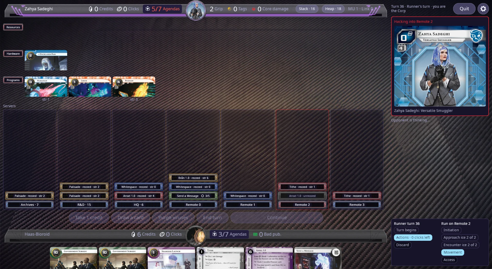
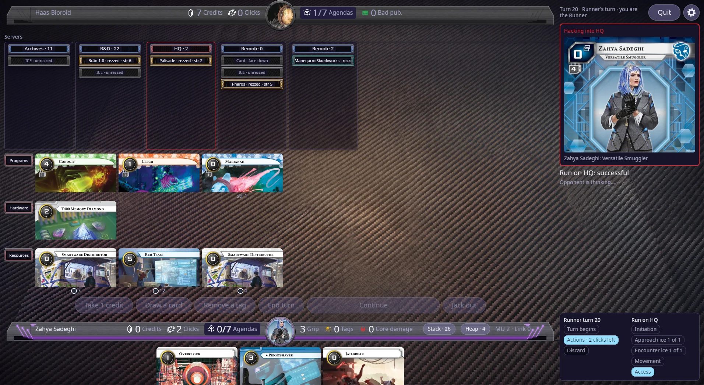

# netrunner-rs

[](https://github.com/lukejohannsen/netrunner-rs/actions/workflows/ci.yml)
[](https://github.com/lukejohannsen/netrunner-rs/actions/workflows/deep-sweep.yml)
[](LICENSE)

A deterministic, data-driven engine for the **Netrunner** card game, written in Rust.

The rules engine is a pure state machine with no I/O, no async runtime, and no rendering
dependencies. Card behaviour is expressed as JSON parsed into a small DSL rather than hardcoded in
Rust, and everything else in the workspace — a graphical desktop client, a terminal client, an
authoritative server, bots, and a reinforcement-learning environment — is a consumer of that one
engine.

<p align="center">
  <a href="docs/screenshots/table-corp.webp"></a>
  <a href="docs/screenshots/table-runner.webp"></a>
</p>
<p align="center"><sub>The desktop client deep into a game against the built-in bot — from the Corp's chair on turn 36 (left) and the Runner's on turn 20 (right).</sub></p>

> **Disclaimer**
>
> This project is a free, open-source fan implementation of the Netrunner card game. It is not
> affiliated with, authorized by, or endorsed by Null Signal Games, Fantasy Flight Games, or
> Wizards of the Coast. All card art and text belong to their respective copyright holders.

---

## What it does

- **A pure, deterministic core.** Every state transition is
  `apply_action(state, registry, action) -> Result<(GameState, Vec<GameEvent>), RulesError>`.
  Handlers mutate a clone and return it on success, so a rejected action can never leave the game
  partially mutated — atomicity is structural, not something each handler has to remember.
- **Randomness lives inside the state.** `GameState` carries its own `seed` and `rng_step`, so
  `apply_action` stays a pure function of its two explicit inputs and replaying a recorded action
  history reproduces a bit-identical final state. No RNG is ever threaded in from outside.
- **Decks are files you own.** A deck is a small JSON file — identity, card list, and the notes
  you want alongside it (description, how-to-play prose in Markdown) — saved under your OS data
  directory and buildable from the CLI. Every deck is checked twice before it plays: once for
  whether the engine can run it, once for whether it is legal to build (influence, format pool,
  copy limits).
- **Cards are data, not code.** Card files under `crates/netrunner_core/data/{corp,runner}/` are
  parsed into DSL primitives and embedded at compile time by `build.rs`. Adding a card normally
  means writing JSON, not Rust. *System Gateway*, *Elevation*, *Vantage Point*, *Rebellion
  Without Rehearsal* and *The Automata Initiative* are complete — the whole Startup format —
  with *Parhelion* under way and the rest of NetrunnerDB's pool following set by set
  ([progress](docs/roadmap/nsg-card-pool.md#progress)). Each set has a gate that fails if any
  printed card is neither implemented nor explicitly excluded.
- **Legality has exactly one definition.** `legal_actions` generates candidates and keeps only
  those `apply_action` actually accepts on a cloned state, so what a UI or bot is offered can
  never drift from what the engine permits.
- **Fog of war is enforced at the boundary.** A client receives a `ClientView` — a per-side masked
  projection carrying only that seat's legal actions — and never the real `GameState`. Hidden
  information is structural, not a matter of the client being polite about what it renders.
- **One match loop.** A single pull-shaped `Session` drives every mode: the terminal client pumps
  it synchronously, the server pumps it inside `tokio`, and the RL environment pumps it from
  Python. Sync versus async is a property of who pumps it, never a fork in rules flow.
- **Bots and training.** Random, planner, MCTS and PUCT agents all play from the same masked
  view a human gets, with an optional ONNX policy, a PyO3 gym environment over a fixed action
  space, and a self-play trajectory generator. The planner is the opponent at every rung of the
  difficulty ladder, playing in the style its deck declares.
- **Two clients on one core.** A Bevy desktop client and a ratatui terminal client share
  `netrunner_client`: matches against the bots or online, lessons and the strategy guide, a
  deck builder with NetrunnerDB import, a card browser, and replays of saved games. Online play
  is hosted from a player's own machine; players are identified by an Ed25519 key rather than an
  account.

## Quick start

Requires a Rust toolchain supporting edition 2024 (1.85+).

```bash
# Open the main menu: play the computer, learn to play, your record, settings
cargo run -p netrunner_cli

# The graphical client (Bevy; on Linux it needs the ALSA and udev headers,
# `libasound2-dev libudev-dev` on Debian). Shares its decks, record and
# settings with the terminal client. Run it through cargo so it finds its
# assets; the first build is slow.
cargo run -p netrunner_desktop

# Or skip the menu with flags, e.g. a game as the Runner against rung 3
cargo run -p netrunner_cli -- --runner human --corp-level 3

# Build a deck of your own, then play it
cargo run -p netrunner_cli -- deck new my_hb --side corp --identity haas_bioroid_precision_design
cargo run -p netrunner_cli -- deck add my_hb "Hedge Fund" 3
cargo run -p netrunner_cli -- deck list
cargo run -p netrunner_cli -- --corp-deck my_hb --runner-deck stolen_goods   # the menu's form starts on these

# Run bot-vs-bot games with no UI
cargo run -p netrunner_cli -- --headless --games 20

# Network play: Play Online in the menu hosts a game or joins one by address
# (across the internet: docs/playing-online.md).
# Or with flags: start a daemon (it seats a bot), then connect, bringing a deck
cargo run -p netrunner_server -- --serve
cargo run -p netrunner_cli -- --mode remote --deck brick_stack

# Generate self-play training trajectories
cargo run -p netrunner_selfplay -- -n 10 -s 100 -o data/selfplay

# The self-play / train / arena loop (needs the Python venv under scripts/)
scripts/venv/bin/python3 scripts/run_iteration_loop.py -g 2400 -s 64 --window 4

# The gate for any change
cargo test --workspace
cargo clippy --workspace --all-targets
```

Both of those run in CI on Linux for every push and pull request (all but the desktop crate),
along with the security checks (`cargo-deny`, gitleaks, and an audit of the workflows). Windows,
macOS, the desktop crate on all three, `cargo doc`, the optional features and `cargo-machete`
run weekly in `.github/workflows/platforms.yml`, and the two agent-driven sweeps get a weekly
256-seed run. `.github/workflows/ci.yml` explains what each job is for and what is deliberately
left out.

## Workspace layout

| Crate | Role |
|---|---|
| `netrunner_core` | Pure deterministic rules engine, card DSL, embedded card catalog and decks, masking. Everything else depends on this; it depends on nothing but `serde` and `thiserror`. |
| `netrunner_bots` | Automated players over a masked `ClientView`: random, planner, MCTS and PUCT agents, the difficulty ladder and deck styles, `determinize` over what a seat knows, RL observation encoding, optional ONNX policy. |
| `netrunner_session` | The one match decision loop: `Session`, `Seat`, the single step budget, `MatchHistory`, end-of-match classification and take-backs. Every driver pumps this. |
| `netrunner_single_player` | Thin index-based adapter over `netrunner_session` for the RL / fixed-action-space path. |
| `netrunner_protocol` | The wire messages between a server and a client, which both ends depend on and neither owns. |
| `netrunner_server` | Authoritative async host: `MatchSession`, per-seat masked state updates, WebSocket transport, key-based login and the rating book. |
| `netrunner_client` | The toolkit-agnostic core both clients stand on: running a match locally or against a host, settings, saved decks and the deck builder, replays and bug reports, the board's layout rules and the words on every action, lessons and the strategy guide, a language-model opponent, and hosting and joining games over the internet. No rendering, no rules. |
| `netrunner_desktop` | The graphical client (Bevy): a plugin per screen, rendering only the `ClientView` it is given. |
| `netrunner_cli` | The terminal client (ratatui) and the reference for the client contract, plus the headless runner, the bot benchmark, and card, deck and replay subcommands. |
| `netrunner_identity` | A player's Ed25519 key and the signed login statement that binds a proof to one server and one nonce. Pure: no files, no clock, no RNG. |
| `netrunner_rating` | Glicko-2 ratings, one per track, participant and role (Corp and Runner rated separately). Pure: whoever owns the file reads and writes it. |
| `netrunner_card_sync` | The card-image cache and NetrunnerDB decklist import — the only crate doing network I/O for card data. |
| `netrunner_gym` | PyO3 reinforcement-learning environment over the fixed action space. |
| `netrunner_selfplay` | High-volume self-play data generation for training. |

## Documentation

- **[`ARCHITECTURE.md`](ARCHITECTURE.md)** — how the engine is shaped and why: the state and
  execution model, the blocking-guard precedence invariant, the privacy layers, and card data flow.
- **[`ROADMAP.md`](ROADMAP.md)** — the single source of truth for project status: what is done,
  what is open, what is next. It indexes the per-phase records under [`docs/roadmap/`](docs/roadmap/).
- **[`AGENTS.md`](AGENTS.md)** — contributing conventions: the decoupled-engine rule, the DSL
  growth rule, state hygiene, and the testing gates a change has to clear.

## Card data

Card metadata — titles, printed rules text, factions, influence, set information — comes from
**[NetrunnerDB](https://netrunnerdb.com/)**. `scripts/catalog_sync.py` reads its public API v3,
and the resulting catalog — cards, their printings and the sets — is embedded under
`crates/netrunner_core/data/catalog/`. Card files in this repository own only the rules-engine
data, under NetrunnerDB's own card ids; printed metadata is never restated per card.

NetrunnerDB is an independent community project and is not affiliated with this one.

## License

The source code in this repository is licensed under the
[GNU General Public License v3.0](LICENSE).

**The GPL covers this project's own source code only.** The card catalogs under
`crates/netrunner_core/data/catalog/` are data dumps from [NetrunnerDB](https://netrunnerdb.com/)
and include card titles, rules text, flavor text and illustrator credits. **That content is not
covered by this license** and is not this project's to license — it remains the property of its
respective copyright holders, as stated in the disclaimer above.

**Assets are licensed separately, one by one.** Every font, picture and sound committed under
`crates/netrunner_desktop/assets/` is its own work with its own owner and licence, listed in
[`assets/CREDITS.md`](crates/netrunner_desktop/assets/CREDITS.md). Assets made in this project,
including with AI assistance, are GPL-3.0-or-later. Everything else stays its owner's, under
the owner's licence, credited with its author and their website: the Noto fonts (OFL-1.1, the
Noto Project Authors) and Null Signal Games' game symbols (CC BY-ND 4.0, from
[their visual assets](https://nullsignal.games/about/nsg-visual-assets/)). The desktop client's
**About** screen shows the same credits, and those for what it fetches on the player's opt-in.
